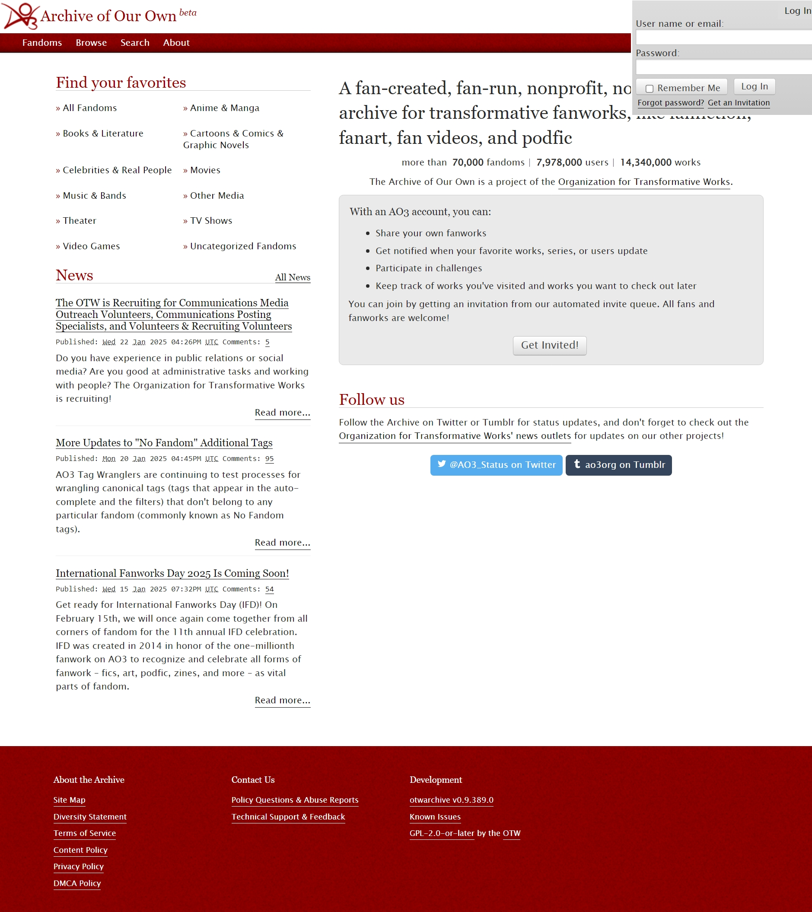

[Home](index.md) | [Manual Assessment Memo](manual_assessment_memo.md) | [Chatbot](chatbot.md) | [Procedure Video](procedure_video.md) | [Manual](manual.md) | [Reflective Blogs](reflective_blogs.md) 

# Table of Contents 
1. [Wayback Analysis](#wayback-analysis)
2. [Quick Start Guide](#quick-start-guide)
3. [Reflective Blog 4](#reflective-blog-4)
4. [Reflective Blog 5](#reflective-blog-5)
5. [Reflective Blog 6](#reflective-blog-6)
6. [Reflective Blog 8](#reflective-blog-8)
   
# Wayback Analysis

## Assignment
For this assignment I chose to compare the Archive of Our Own, also referred to as Ao3, fanfiction website in its preset day for to the late 2009 version. This was a very shocking experience as I had not realized how the standards for web design had changed.
   

The most obvious difference was in the menu of the site. Almost every website today has a top menu usually held with a bar to distinguish it from its surroundings, but for this old version of the page it had its menu bar on the left side, which although not uncommon it was not a separate unmoving section but just part of the page. 
Which leads me to my next observation, sectioning. There were sections in the 2009 version of Ao3 but only distinguished though bolded text as headings, there was no distinct sectioning with boxes of any kind not even lines. While the current version of the website has headers of larger size and color along with lines to show different sections as well as a alternate color background for a box section.

A few other differences are in the links, menu, and design. The old website still has blue links which is something I had not realized was obsolete until I saw it. The current website menu and login are both drop down while the previous version does not have that capability. There is also a lot less color, the old version only has one part with color and that’s a picture of the logo, whereas the current version has the websites signature color, red, incorporated into the site as a background color in the menu and footer, as well as the color for headings and the title of the website.

The website felt incredibly old; it was at times difficult to navigate due to me unconsciously expecting things to be in different places. 

---
# Quick Start Guide

## Assignment
For this assignment I have chosen to explain the steps that need to be taken to self-install a Spectrum Wi-Fi modem and router.
1. Connect the modem.
- Plug the white coax cable into the circular port marked Cable and finger tighten into the modem then the cable outlet. 
- Next take the black power cable and plug it in the modem in the port second from bottom marked Power.

- Wait for the lights on the front of the modem labeled Power and Online to turn solid blue.
2. Connect the modem to the router.
- Use the yellow ethernet cable, plug it into the yellow port marked Internet on both the modem and the router.

- Then take the remaining black power cable and plug it into the bottom port of the router labeled power.

- Wait for the light on the front of the router labeled Spectrum to turn either solid blue or pulsing red.
3. Connect Your Device to the Wi-Fi Network
- Open Wi-Fi settings on your chosen device, select the Default Wi-Fi Network Name of the network found on the back of the router, then enter the Password also found on the back of the router.
4. Activate Modem
- Click [spectrum](https://www.spectrum.net/selfinstall) and follow the instructions.

---
# Reflective Blog 4

## Prompt P: Create your own brief explanation of how to do something
## How To Knit

### Making a Slipknot
The first loop of yarn placed on the right-hand needle is called a slipknot and is counted as a cast-on stitch since you will knit into it on the next row. Pull approximately ten inches of yarn from the yarn skein. Make a circle and place the yarn ball behind the circle. Insert the needle and pull the yarn through to form a loop. Pull down on both ends of the yarn to complete the slipknot. The slipknot counts as your first cast-on stitch. 
### Casting on
Every knitting project begins by adding loops of yarn onto one needle; this is called casting on. Casting on with a needle involves leaving a four-inch tail, making a slipknot, and placing it on the left-hand needle. Insert the right-hand needle from front to back through the loop under the left-hand needle. At the back side of the work, wrap the yarn clockwise around the right-hand needle, catch the strand, and draw it through the slipknot or stitch. Insert the left-hand needle into the loop just formed from back to front and transfer it onto the left-hand needle. Repeat for the desired number of sitches.
### Wrapping yarn and holding needles
To thread the yarn in your right hand, position the ball of yarn to your left and the tail to your right. Hold your right palm facing up and use your right pinky finger to hook the tail toward you. Turn your palm down, allowing the yarn to drop under your two middle fingers and over your index finger. The yarn and needles are held lightly in your hands. The point of the right-hand needle will be in the slipknot or first stitch on the left-hand needle. You will position the point from front to back to make a knit stitch, or from back to front to make a purl stitch.
### Knitting a stitch
There are two main stitches in knitting. The knit stitch is the first. Hold the needle with the cast-on loops under your left hand. The yarn and other needle are under your right hand. Make sure the yarn is on the far side of the needle. Insert the right-hand needle from front to back into the first loop; the point should be sticking out of the far side, pointing away from you. Using your right index finger to work the yarn, wrap the yarn under and clockwise around the projecting point. Catch the wrap of yarn on the right-hand needle and draw a loop through to the near side facing you. Then drop the first loop off the left-hand needle; nudge it off with your finger if necessary. You will now have one loop, in knit stitch, on the right-hand needle and one less loop from your original cast-on row on the left-hand needle. The strand of yarn will now be behind the right-hand needle instead of behind the left-hand needle. That’s all there is to it.
### Pearling a stitch
The purl stitch is the other half of basic knitting. The bumps look like pearls, which is why the stitch is called purl. Make sure the yarn is on the front side of the needle before starting the stitch. Insert the right-hand needle from back to front into the loop on the needle. Wrap the working yarn counterclockwise, draw the new loop through to the back, and drop off the old loop. The strand of working yarn will now be in front of the right-hand needle instead of in front of the left-hand needle. The purl stitch is exactly as easy as the knit stitch because purling is simply knitting from the back of the fabric to the front. 
### Binding off
Binding off is the opposite of casting on. It can be done across an entire row at once or a few stitches at a time to shape necklines or sleeves. Stitches are removed one by one and locked so they do not unravel. The bound-off edge should be stretchy but firm enough to hold its shape. The most common bind-off used is the lift-over bind-off.  
**Knit lift-over bind-off**  
1. Knit two stitches, lift the first stitch over the second stitch, and drop it off the right-hand needle.  
2. Knit one and repeat the first step until one stitch remains. Bind off the last stitch by pulling the yarn through the final loop. In patterns, this is called fastening off.  
No AI was used in the writting of this reflective blog.  
---
# Reflective Blog 5

## Prompt R:

When making my chatbot I could see that there were pros and cons. An AI is very good at taking in and repeating fact but it also struggles to understand how much information to give, often times reiterate all information it has on the topic, and must be trained to give this information in degrees. I also noticed it struggled to read in information not in basic format. My original resume had to be broken down into basic text instead of the structured table it was originally in so that the chatbot could read it. But the chatbot was able to very easily generate a personalized experience and felt much more human like than anticipated. I believe that chatbot will definitly be used a lot more often in the future, becoming integrated in daily life.

No AI was used in this reflective blog

---
# Reflective Blog 6

## Prompt Q:

I entered my resume into my Chatbot AI and asked it to revise it to better appeal to prospective employers. The improvements it made include:
1. Added a strong professional summary
2. Organized skills into clear categories
3. Enhanced job experience descriptions with action verbs
4. Created distinct sections for better readability
5. Highlighted both technical and soft skills
6. Incorporated information from your interview responses to strengthen the profile

I really liked the professional summary that the AI provided, I sometimes struggle to describe myself and this was a great help. While my resume already had sections the AI provided clearer titles and added a few sections I had not realized were necessary. I really appreciated the enhanced job descriptions as I was unaware that this was a suggested aspect of resumes. Overall the AI was very helpfull in strengthening my resume and I will be implementing the suggested improvements.

No AI was used in the writting of this reflective blog.

---
# Reflective Blog 8

## Prompt K 

Knitting is a soothing and creative craft where loops of yarn are interwoven to create fabric. Here's a brief guide to get started:  

1. Gather Materials: You'll need yarn, knitting needles (usually matching the size recommended on the yarn label), and scissors.
2. Casting On: Begin by creating a "slip knot" on one needle, then loop the yarn onto the needle repeatedly to form the starting stitches—this is your foundation.
3. The Knit Stitch: Hold the needle with the stitches in your left hand and the empty needle in your right. Insert the right needle into the first stitch from front to back. Wrap the yarn around the right needle, then pull it through the stitch to create a new loop. Slide the old stitch off the left needle.
4. Repeat: Continue knitting across the row, moving one stitch at a time.
5. Switch Needles: Once you've finished the row, swap the needles so the full one is now in your left hand, and repeat the process for the next row.
6. Binding Off: When you’re done knitting, secure the final row by passing one stitch over the next until only one remains. Snip the yarn, pull it through the last loop, and tighten.

Knitting involves rhythm and repetition, and beginners can start with simple projects like scarves before progressing to more complex patterns. Practice builds mastery! Let me know if you’d like tips or help choosing your first project.  
  
--
The AIs strengths include: Concise and beginner friendly, Clear structure; Encouragement for practice, Simplified instructions; while its weaknesses are: Less Detail, Limited Variations, No Visuals. My strengths: Technical Precision, Comprehensive Coverage, Step-by-Step Detail; weaknesses: 1)	Length and Complexity, Terminology Assumptions.

    
--The AI explanation prioritizes simplicity and accessibility, while mine excels in depth and precision. 

No AI was used in the writting of this reflective blog.
